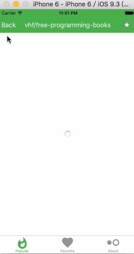
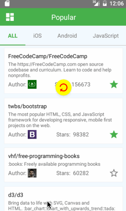

# GitHubPopular
This is a GitHub most popular repositories viewer with React Native.  
## DownLoad APP  
Android:  
[GitHubPopular-release-v1.0.0.apk](https://raw.githubusercontent.com/crazycodeboy/GitHubPopular/master/resource/apk/GitHubPopular-release-v1.0.0.apk)  
  
## How does it look like?
iOS:  
  
Android:  
  
## How to run

1. Prepare your environment: [Requirements](http://facebook.github.io/react-native/docs/getting-started.html#requirements)
2. Clone [GitHubPopular](https://github.com/crazycodeboy/GitHubPopular.git), and goto the project root directory.
3. run `npm i`.
4. run `react-native run-ios` or `react-native run-android`.
5. Yeah. You make it.
